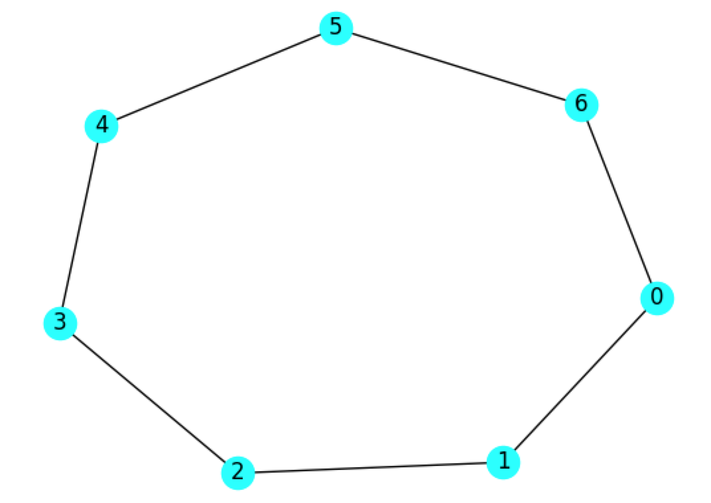
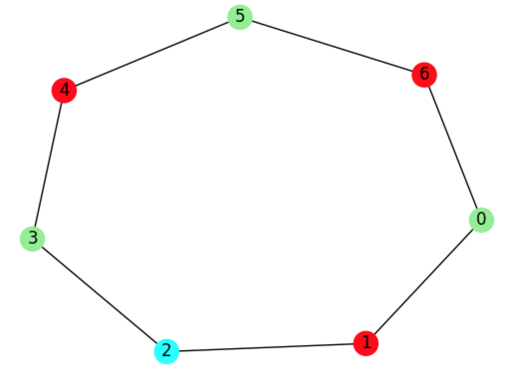
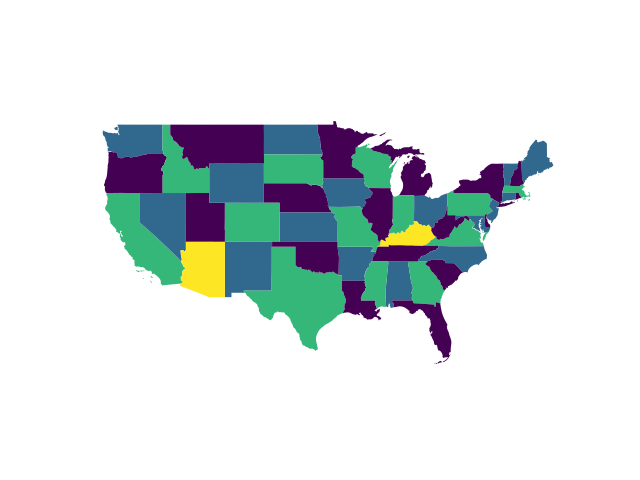

# Graph Coloring

A demo of graph coloring using Leap's hybrid constrained quadratic model (CQM)
solver.



Figure: The graph that we want to color with no neighboring nodes the same.

We want to color this graph so that no neighboring nodes have the same color.
This is a well-known hard problem (https://en.wikipedia.org/wiki/Graph_coloring)
and an alternative formulation is available in this Collection of Code Examples
(https://github.com/dwave-examples/map-coloring). In this example, we formulate
this problem as a constrained quadratic model (CQM) and solve it using the
hybrid CQM solver.

## Usage

To run the graph coloring demo, enter the command:

```bash
python graph_coloring.py
```

The program will print out the number of colors used and whether or not the
solution is valid, and produce an image of the solution saved as
`result_graph.png`.



Also included is a map coloring demo, `map_coloring.py`. To run the map
coloring demo, enter the command:

```bash
python map_coloring.py
```

The map coloring demo has an option to run on the Canadian map (`-c canada`) or
the USA map (`-c usa`, default) and produces an output image file as shown
below.



## Code Overview

The hybrid CQM solver accepts problems expressed in terms of a
ConstrainedQuadraticModel object. A CQM consists of an objective and constraints, both formulated in this example as Binary Quadratic Models (BQMs).

For this problem, define binary variables as ordered pairs (node, color). For
example, the pair `(1, 2)` corresponds to node 1 and color 2. In the map
coloring example, the pair will look like `('Maryland', 0)` to indicate that
the state of Maryland should be colored with color 0 in the USA map. If
variable `(n, i)` equals 1 then we assign node `n` color `i`.

### Objective

We set the objective in order to use as few colors as possible. We assume a
very simple relationship: variable (node, k) is given a coefficient of k in our
objective function. This will encourage the solver to use the lowest numbered
colors as much as possible by minimizing the overall number of colors used.

### Constraints

In this example, we have two groups of constraints.

#### Discrete Constraints

We defined our CQM using binary variables `(n, i)` to indicate assigning color
`i` to node `n`. Since each node must be assigned exactly one color, we need to
add a set of discrete constraints: one for each node `n`.

#### Edge Constraints

Our assignment of colors to nodes must satisfy the constraint that no edge has
endpoints with the same color. In terms of map coloring, this is equivalent to
no adjacent region having the same color assigned.

To build this constraint, we consider each edge `(u,v)` independently, and each
possible color independently as well. For edge `(u,v)` and color `i`, we want
to ensure that binary variables `(u,i)` and `(v,i)` are not both equal to 1.
All other combinations are acceptable. We can determine an expression for this
using a truth table, as shown below.

|`(u,i)`|`(v,i)`|Acceptable?|
|-----|------|-----|
|0|0|Yes (0) |
|0|1|Yes (0) |
|1|0|Yes (0) |
|1|1|No (1) |

By using one value (0) to denote "Yes" and a different value (1) to denote
"No", we are able to formulate a mathematical expression to build the
constraint. This constraint can be expressed as `(u,i) * (v,i) == 0`.

## License

Released under the Apache License 2.0. See [LICENSE](LICENSE) file.
